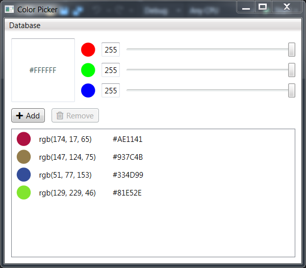

# Uppgift 11 - _Windowsprogrammering, Nackademin_

### Assignment
> "Create a colorpicker in WPF with only data binding (no code-behind). User shall be able to change RGB values of the color, see the preview, store the color in a list, and if so wish (via a menu bar) sync the list with a database."

---

